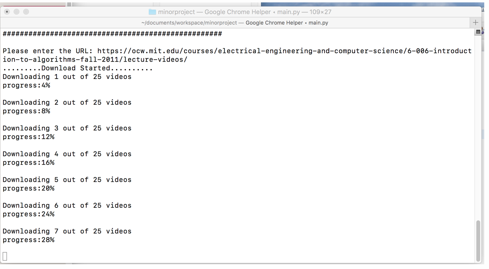
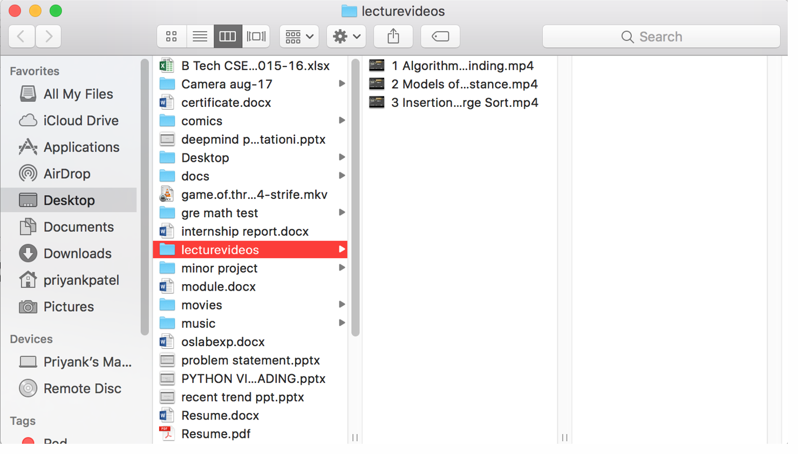

# Python-Video-Download-Library
This is a library used to download course material from various online course sites.

## Getting Started

These instructions will get you a copy of the project up and running on your local machine for development.

### Prerequisites

* Install the [Python](https://www.python.org/) in your PC.
* Install the [pip](https://pypi.org/project/pip/)

### Installing

A step by step series of examples that tell you how to get a development env running.
* Open the terminal or powershell and go to the project path and type the below command


```
  pip install -r requirements.txt 
```


* open terminal or powershell and enter the below command

```
python main.py
```


## Built With

* [Python](https://www.python.org/)  - The framework used to create server 


## Screenshots

   
   

## Authors

* **Srirama Dheeraj** - [DheerajRam13](https://github.com/dheerajram13/)
